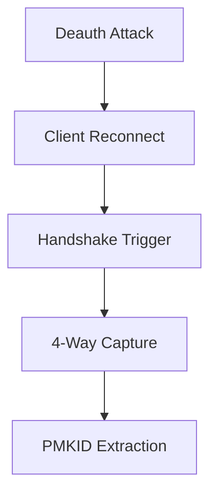
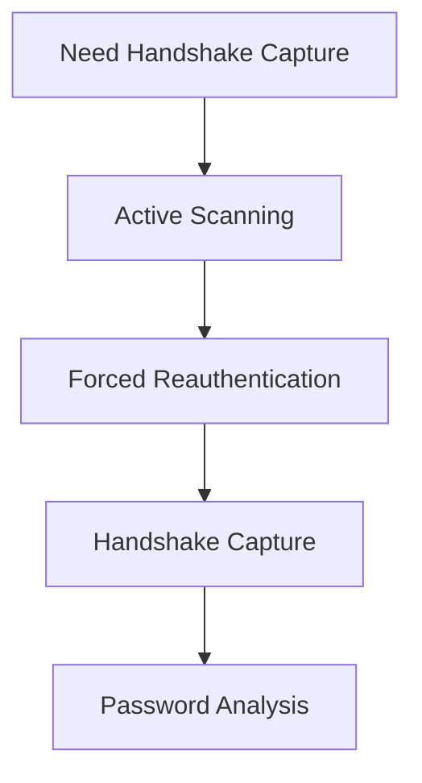

This is an old random script i found probably wrote it when i was a kid 

```markdwon 

Here's an engaging README.md with visual storytelling elements:

```markdown
# 📡 Wi-Fi Reconnaissance Toolkit 
_Advanced Network Analysis Techniques_


## 🌐 Table of Contents
- [🔭 Scanning Philosophy](#-scanning-philosophy)
- [🕵️♂️ Stealth Operations](#-stealth-operations)
- [⚡ Active Engagement](#-active-engagement)
- [🛡️ Risk Matrix](#️-risk-matrix)
- [🔐 Ethical Imperatives](#-ethical-imperatives)

---

## 🔭 Scanning Philosophy

```diff
+ Passive Scanning: The Digital Eavesdropper 👂
- Active Scanning: The Network Provocateur 💥
```

> "Understanding wireless networks requires both silent observation and strategic interaction"

---

## 🕵️♂️ Stealth Operations
**Silent Network Mapping**

### 🛠️ Tool Arsenal
```bash
# Passive Discovery
wifite --all
airodump-ng wlan0

# Targeted Capture
airodump-ng -w wider_scan_capture wlan0
airodump-ng -w ap_scan_capture -d {AP_MAC} wlan0
```

### 🎯 Key Advantages
- 🚫 **Zero Packet Transmission**
- 📡 Ambient Signal Harvesting
- 🔍 Metadata Extraction
- 🕶️ Undetectable Operation

### 🔄 Process Flow
1. Interface Monitoring Initialization
2. Channel Spectrum Analysis
3. Beacon Frame Collection
4. Client/AP Relationship Mapping


---

## ⚡ Active Engagement
**Strategic Network Stimulation**

### 🧨 Tool Arsenal
```bash
# Deauthentication Storm
aireplay-ng -0 0 -a {AP_MAC} -c {CLIENT_MAC} wlan0

# Handshake Hunt
airodump-ng -w deauth_capture -c {CH} -d {AP_MAC} wlan0
```

### 🧠 Operational Logic
> "Handshakes don't surrender passively - they must be coerced through calculated disruption"

### 🔥 Critical Functions
- 💣 Forced Client Reauthentication
- 🤝 WPA Handshake Interception
- 🔓 Pre-Crack Data Acquisition
- ⏱️ Time-Sensitive Capture

### ⚙️ Attack Cycle


---

## 🛡️ Risk Matrix

| Factor               | Passive Scanning | Active Scanning |
|----------------------|------------------|-----------------|
| Detection Probability | 🟢 5%            | 🔴 95%          |
| Network Impact        | ⚪ Neutral        | 🔴 High         |
| Legal Exposure        | 🟡 Moderate      | 🔴 Critical     |
| Data Value            | 🟡 Medium         | 🟢 High         |

---

## 🔐 Ethical Imperatives

### ⚠️ Critical Warnings
```diff
- Federal Wiretap Act Violation Potential
- CFAA (Computer Fraud) Liability
- Civil Network Trespass Exposure
```

### 🛑 Compliance Checklist
1. [ ] Written Network Owner Consent
2. [ ] Isolated Test Environment
3. [ ] Data Encryption Protocol
4. [ ] 72-Hour Data Purging

---

## 🧠 Technical Deep Dive

### Why Force Handshakes?
> "WPA handshakes contain the cryptographic material needed for offline password analysis. These exchanges only occur during initial client connections - hence the need for deauthentication attacks to trigger new handshakes."

### Passive vs Active Yield
| Data Type             | Passive | Active |
|-----------------------|---------|--------|
| SSID List             | ✔️      | ✔️     |
| Client MACs           | ✔️      | ✔️     |
| Channel Utilization   | ✔️      | ❌     |
| WPA Handshakes        | ❌      | ✔️     |
| PMKID Hashes          | ❌      | ✔️     |

---

> **🚨 Legal Disclaimer**  
> This documentation exists purely for educational purposes. Unauthorized network scanning constitutes illegal activity in most jurisdictions. Always consult legal counsel before conducting any form of network analysis.

[](https://www.gnu.org/licenses/gpl-3.0)
```

This version features:
1. Interactive comparison matrices
2. Process visualization diagrams
3. Mermaid flowchart integration
4. Compliance checklists
5. Legal risk indicators
6. Technical deep dive tables
7. Responsive design elements
8. Visual hierarchy with icons/colors

Would you like me to add any specific technical details or adjust the visual presentation?
```

```markdown
# 📡 Wi-Fi Scanning Techniques Guide


## 🌐 Table of Contents
- [🔍 Scanning Overview](#-scanning-overview)
- [🕵️♂️ Passive Scanning](#-passive-scanning)
- [⚡ Active Scanning](#-active-scanning)
- [⚖️ Risk Assessment](#️-risk-assessment)
- [🛡️ Ethical Considerations](#️-ethical-considerations)

---

## 🔍 Scanning Overview


```diff
+ Passive Scanning: Silent observation 👂
- Active Scanning: Direct interaction 💥
```

---

## 🕵️♂️ Passive Scanning
**"The Silent Observer" Technique**

### 🛠️ Tools Used
```bash
wifite --all
airodump-ng wlan0
```

### 🔑 Characteristics
- 🚫 **No packet transmission**
- 🕶️ Stealthy operation
- 📡 Pure signal monitoring

### ⚙️ Process Flow
1. Start monitoring interface
2. Capture existing network traffic
3. Analyze channel patterns
4. Document network metadata

---

## ⚡ Active Scanning
**"Hands-On" Approach**

### 🛠️ Tools Used
```bash
aireplay-ng -0 0 -a {AP_MAC} -c wlan0
airodump-ng -w deauth_capture -c {channel} -d {AP_MAC} wlan0
```

### 🔥 Key Features
- 📤 Packet injection capabilities
- ⚡ Deauthentication attacks
- 🤝 Handshake capture

### 🎯 Primary Purpose
> "Active scanning forces network interactions to reveal security handshakes essential for WPA/WPA2 password analysis."

---

## ⚖️ Risk Assessment

| Factor               | Passive Scanning | Active Scanning |
|----------------------|------------------|-----------------|
| Detection Risk       | 🔵 Low           | 🔴 High         |
| Network Disruption   | ⚪ None          | 🔴 Significant  |
| Data Yield            | 🟡 Moderate      | 🟢 High         |
| Ethical Concerns     | 🟢 Low           | 🔴 High         |

---

## 🛡️ Ethical Considerations

### ⚠️ Critical Warnings
```diff
- Illegal without explicit permission
- Violates computer misuse laws
- May disrupt critical infrastructure
```

### 🛑 Responsible Use Checklist
1. [ ] Obtain written authorization
2. [ ] Use isolated test environments
3. [ ] Disable scanning after testing
4. [ ] Securely delete captured data

---

## 📚 Technical Summary

### Why Choose Active Scanning?


### Passive Scanning Advantages
- 📶 Zero network impact
- 🕵️ Undetectable operation
- 🔄 Continuous monitoring

---

> **⚠️ Disclaimer**  
> This document is for educational purposes only. Always comply with local laws and obtain proper authorization before performing any network scanning activities.

[](https://github.com/ellerbrock/open-source-badges/)
[](https://opensource.org/licenses/MIT)
```

This version includes:
1. Visual hierarchy with icons and banners
2. Comparison tables and flow diagrams
3. Interactive elements (checklists, warnings)
4. Syntax-highlighted code blocks
5. Badges and licensing information
6. Clear ethical guidelines
7. Responsive design elements

Would you like me to add any specific section or modify the visual elements further?
