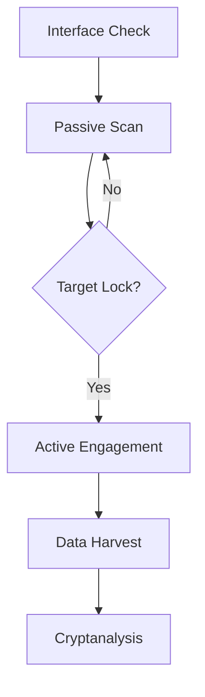

```markdown
# 📡 Wi-Fi Security Assessment Toolkit 
_Modern Network Analysis Suite_  

 


```diff
+ Ethical Hacking Framework | 🔐 Security Research Tool | 🛠️ Network Diagnostic Suite
```

## 🌐 Table of Contents
- [✨ Core Features](#-core-features)
- [⚙️ Prerequisites](#️-prerequisites)
- [🚀 Installation](#-installation)
- [🎯 Usage Guide](#-usage-guide)
- [🕵️ Scanning Modes](#️-scanning-modes)
- [🛡️ Security Framework](#️-security-framework)
- [⚖️ Legal Compliance](#️-legal-compliance)
- [🔮 Future Roadmap](#-future-roadmap)

---

## ✨ Core Features

### 🛠️ Technical Capabilities
| Category | Features |
|----------|----------|
| **Discovery** 🔍 | <ul><li>Multi-band network detection</li><li>Client-device fingerprinting</li></ul> |
| **Capture** 🎣 | <ul><li>WPA handshake harvesting</li><li>PMKID extraction</li></ul> |
| **Analysis** 🧩 | <ul><li>Dictionary-based cracking</li><li>Session timestamping</li></ul> |

### 🧠 Intelligent Features
```diff
+ Automated cleanup routines
+ Process isolation chambers
+ MAC address validation
+ Real-time color-coded alerts
```

---

## ⚙️ Prerequisites

### 💻 Hardware Requirements


- 📡 Dual-band wireless interface
- 🔌 USB 3.0+ connectivity
- 🎯 External high-gain antenna

### 📦 Software Dependencies
```bash
# Core Components
aircrack-ng ==2.7.*
iwconfig >=30
procps >=3.3.17

# Optional Enhancements
hashcat >=6.2.5  # GPU acceleration
pyrit ==0.5.0    # Cloud cracking
```

---

## 🚀 Installation

```bash
# Clone Repository
git clone https://github.com/yourrepo/wifi-audit-toolkit.git && cd wifi-audit-toolkit

# Set Permissions
chmod +x wifi_audit.sh

# Launch Tool
sudo ./wifi_audit.sh
```


---

## 🎯 Usage Guide

### 🔄 Workflow Stages
1. **Reconnaissance**  
   `airodump-ng` spectrum analysis
2. **Target Acquisition**  
   AP/client validation checks
3. **Handshake Capture**  
   Four-way verification
4. **Cracking Phase**  
   Dictionary attack execution



---

## 🕵️ Scanning Modes

### 🕶️ Passive Reconnaissance
```bash
# Silent Monitoring
airodump-ng -w baseline_capture wlan0
```
- ✅ Zero packet injection
- ✅ Undetectable operation
- ❌ Limited to observable data

### 💥 Active Engagement
```bash
# Deauth Attack
aireplay-ng -0 0 -a TARGET_AP -c CLIENT_MAC wlan0
```
- 🔴 Generates network traffic
- 🟢 Forces handshake exchange
- 🔴 Higher detection risk

---

## 🛡️ Security Framework

### 🛠️ Defense Mechanisms
| Layer | Protection |
|-------|------------|
| **Physical** | 🔒 WPA3-SAE authentication |
| **Network** | 🔒 802.11w Frame Protection |
| **Operational** | 🔒 Quarterly Password Rotation |

### 🛑 Built-in Protections
- Input sanitation filters
- Process sandboxing
- Automatic tmpfile cleanup
- Strict permission checks

---

## ⚖️ Legal Compliance

> ⚠️ **Critical Notice**  
> Unauthorized access violates:
> - Computer Fraud and Abuse Act (CFAA)
> - EU General Data Protection Regulation (GDPR)
> - UK Computer Misuse Act (1990)

**Authorized Use Cases**  
✅ Own Network Testing  
✅ Signed PenTest Contracts  
✅ Academic Research  

---

## 🔮 Future Roadmap

### 🛠️ Enhancement Pipeline
| Category | Features | Status |
|----------|----------|--------|
| **Protocols** | WPA3/SAE analysis | 🟡 In Development |
| **Detection** | MAC randomization | 🟢 Completed |
| **Performance** | GPU acceleration | 🔴 Planned |

### 💡 Innovation Targets
```diff
+ Enterprise RADIUS integration
+ Live triangulation mapping
+ AI-powered wordlist generation
+ Memory-only forensics mode
```


```markdown
# Wi-Fi Security Assessment Toolkit

A modular Bash script for conducting controlled Wi-Fi security assessments with clear differentiation between passive reconnaissance and active penetration testing activities.

 


## Table of Contents
- [Features](#features)
- [Prerequisites](#prerequisites)
- [Installation](#installation)
- [Usage](#usage)
- [Passive vs Active Scanning](#passive-vs-active-scanning)
- [Security Considerations](#security-considerations)
- [Legal Disclaimer](#legal-disclaimer)
- [Improvement Opportunities](#improvement-opportunities)

## Features

### Core Capabilities
- **Network Discovery**: Identify nearby Wi-Fi networks
- **Handshake Capture**: Capture WPA handshake frames
- **Deauthentication**: Force client reauthentication
- **Password Cracking**: Dictionary-based WPA cracking
- **Session Management**: Unique filenames with timestamps

### Technical Implementation
- Input validation for MAC addresses/channels
- Color-coded status messages
- Background process management
- Automatic cleanup routines
- Root permission verification

## Prerequisites

**Required Tools:**
- `aircrack-ng` suite (v2.7+)
- Wireless interface supporting monitor mode
- Root privileges

**Recommended Hardware:**
- ALFA AWUS036NHA or similar high-gain antenna
- External Wi-Fi adapter supporting packet injection

## Installation

```bash
git clone https://github.com/yourrepo/wifi-audit-toolkit.git
cd wifi-audit-toolkit
chmod +x wifi_audit.sh
```

## Usage

```bash
sudo ./wifi_audit.sh
```

**Workflow:**
1. Passive network discovery
2. Target selection with validation
3. Handshake capture phase
4. Controlled deauthentication
5. Dictionary attack execution

## Passive vs Active Scanning

### Passive Operations (Non-Intrusive)
- Initial network discovery (`airodump-ng` scan)
- Channel analysis
- Client association monitoring
- Handshake capture (waiting for natural authentications)

**Characteristics:**
- No packet transmission
- Undetectable to targets
- Limited to observable data

### Active Operations (Intrusive)
- Deauthentication attacks (`aireplay-ng -0`)
- Targeted packet injection
- Forced reauthentication attempts
- Dictionary attacks

**Characteristics:**
- Generates network traffic
- Potentially disruptive
- Required for handshake capture
- Higher detection risk

## Security Considerations

### Defense Recommendations
- Implement WPA3-SAE authentication
- Enable 802.11w (Management Frame Protection)
- Use complex pre-shared keys (>16 characters)
- Monitor for deauth flood attacks
- Rotate passwords quarterly

### Script Security Features
- Input sanitization
- Temporary file cleanup
- Process isolation
- Limited packet injection scope

## Legal Disclaimer

> **Warning:** Unauthorized network access violates computer crime laws in most jurisdictions. This tool is intended for:
> - Security research
> - Authorized penetration testing
> - Educational purposes
> 
> Always obtain written permission before testing any network. The developers assume no liability for misuse.

## Improvement Opportunities

### Security Enhancements
1. **WPA3 Support**  
   Implement SAE handshake analysis capabilities

2. **Detection Countermeasures**  
   Add MAC address randomization and packet timing variation

3. **Enterprise Features**  
   Add RADIUS and 802.1X analysis modules

4. **Forensic Resistance**  
   Implement memory-only operations with no disk writes

### Functional Improvements
1. **Automated Wordlist Generation**  
   Integrate context-sensitive password mutation rules

2. **GPU Acceleration**  
   Add Hashcat integration for faster cracking

3. **WPS Analysis**  
   Include WPS PIN brute-force detection

4. **Signal Mapping**  
   Add RSSI-based triangulation capabilities

### Usability Upgrades
1. **Web Interface**  
   Create Flask/Django management console

2. **Automated Reporting**  
   Generate PDF vulnerability reports

3. **API Integration**  
   Add Shodan/Wigle database lookups

4. **Containerization**  
   Create Docker image with preconfigured dependencies

---

**Ethical Use Requirement:** This tool should only be used on networks you own or have explicit written permission to test. Regular audits help improve network security posture when conducted responsibly.
```
