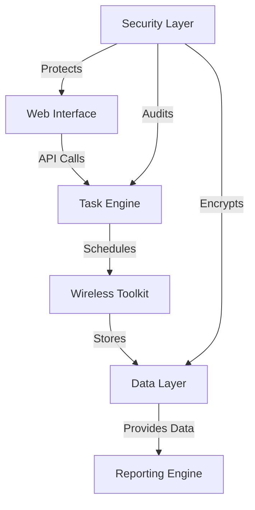
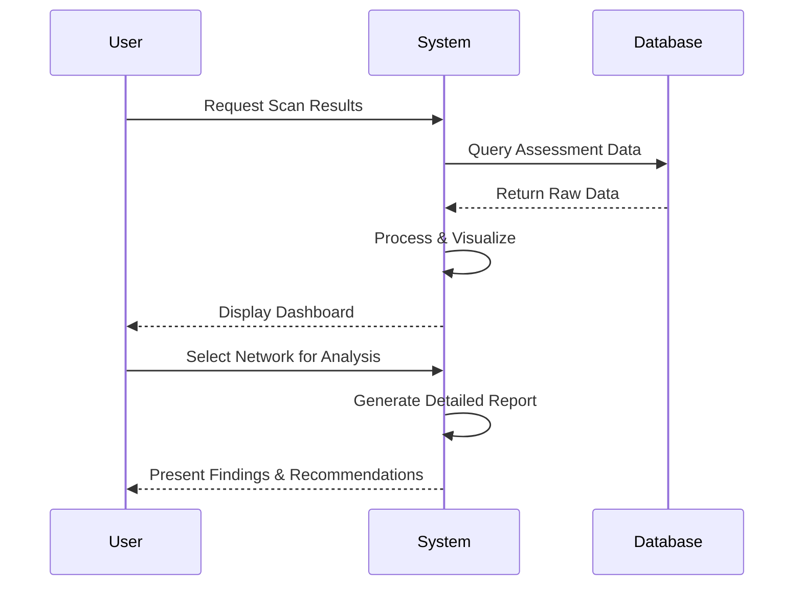
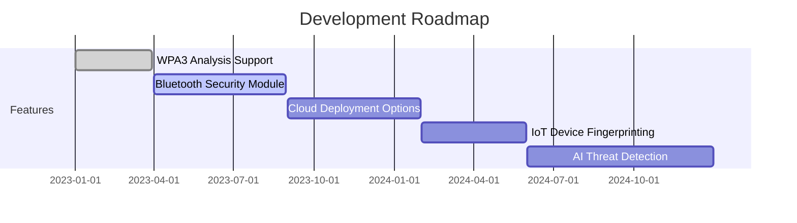

```markdown
# 🛡️ Enterprise Wireless Security Assessment Platform

<div align="center">


[](https://www.python.org/)
[](https://flask.palletsprojects.com/)
[](https://www.aircrack-ng.org/)
[](https://www.docker.com/)
[](LICENSE)

</div>

> 🔐 **Enterprise-Grade Wireless Security Analysis** | 📊 **Comprehensive Reporting** | 🔄 **Automated Workflows**

A sophisticated wireless network security evaluation system combining powerful CLI penetration testing tools with an intuitive web-based management interface. Designed for enterprise security teams conducting authorized wireless security audits with complete audit trail capabilities.

---

## 📑 Table of Contents

- [🏗️ Architecture Overview](#️-architecture-overview)
- [✨ Key Features](#-key-features)
- [🔧 Technical Specifications](#-technical-specifications)
- [📦 Installation & Deployment](#-installation--deployment)
- [📘 Usage Guide](#-usage-guide)
- [🔒 Security Considerations](#-security-considerations)
- [✅ Compliance](#-compliance)
- [🛣️ Roadmap](#️-roadmap)
- [👥 Contributing](#-contributing)
- [⚖️ License](#️-license)

---

## 🏗️ Architecture Overview

<div align="center">
  


</div>



The platform implements a modular microservices architecture:

| Component | Technology | Purpose |
|-----------|------------|---------|
| 🖥️ **Web Interface** | Flask/React | Management console and visualization |
| ⚙️ **Task Engine** | Celery/RabbitMQ | Asynchronous operations and scheduling |
| 📡 **Wireless Toolkit** | aircrack-ng suite | Protocol analysis and security testing |
| 💾 **Data Layer** | PostgreSQL/Redis | Persistent storage with caching |
| 📊 **Reporting Engine** | WeasyPrint/Pandas | Data analysis and report generation |
| 🔐 **Security Layer** | JWT/OAuth/OPA | Authentication, authorization, and audit |

---

## ✨ Key Features

### 📡 Core Functionality

<div align="center">

```diff
+ 802.11 a/b/g/n/ac/ax Wireless Protocol Analysis
+ WPA/WPA2/WPA3 Enterprise & Personal Security Audits
+ Evil Twin Attack Simulation & Detection
+ KRACK and FragAttacks Vulnerability Testing
```

</div>

- 🔍 Simultaneous Multi-Interface Monitoring
- 🤝 Automated Handshake Capture & Validation
- 🔑 Rainbow Table & Dictionary Attack Integration
- 👤 Client Device Fingerprinting (OUI, Protocols, Behavior)
- 📶 Signal Strength Mapping & Coverage Analysis
- 🚫 Rogue Access Point Detection

### 🖥️ Management Console

<div align="center">
  


</div>

- 📊 Real-time Spectrum Analysis Dashboard
- 📈 Historical Scan Comparison Tools
- 📚 Vulnerability Knowledge Base Integration
- 📝 Collaborative Report Annotation
- ⏱️ Scheduled Scan Configuration
- 🗺️ Device Geolocation Mapping (Wi-Fi Triangulation)

### 🔒 Security Features

```bash
# Role-Based Access Model
┌────────────┬─────────────┬─────────────┬─────────────┐
│ Permission │   Analyst   │  Engineer   │ Admin       │
├────────────┼─────────────┼─────────────┼─────────────┤
│ View Scans │     ✅      │     ✅      │     ✅      │
│ Run Scans  │     ❌      │     ✅      │     ✅      │
│ Edit Scans │     ❌      │     ✅      │     ✅      │
│ User Mgmt  │     ❌      │     ❌      │     ✅      │
└────────────┴─────────────┴─────────────┴─────────────┘
```

- 🔐 Role-Based Access Control (RBAC)
- 🎫 JWT Authentication with Refresh Tokens
- 🧾 Complete Audit Trail with Action Playback
- 🔒 AES-256 Encrypted Session Storage
- 🛡️ HSM Integration for Credential Management
- 📜 Automated Evidence Chain-of-Custody

### 📋 Reporting System

<div align="center">


</div>

- 📑 Executive Summary Generation
- 🔬 Technical Findings Catalog
- 📏 Compliance Gap Analysis
- 📉 Remediation Workflow Tracking
- 📤 Multiple Export Formats (PDF, DOCX, JSON)
- 🔗 Automated CVE Cross-Reference

### 🚀 Deployment Options

- 🐳 Docker Swarm/Kubernetes Ready
- 🔌 Air-Gapped Environment Support
- 👥 Multi-User Team Collaboration
- 🔄 SCAP Integration
- 📡 SIEM Integration (Splunk, ELK)
- 💾 Automated Backup & Recovery

---

## 🔧 Technical Specifications

### ⚙️ Prerequisites

```diff
! Linux Kernel 5.4+ (Recommended: Kali Linux 2023.4)
! Wireless Adapter with Monitor Mode & Packet Injection
! Docker Engine 24.0+
! Minimum 4GB RAM (8GB Recommended)
! 20GB Disk Space (SSD Recommended)
```

### 📚 Dependencies

<div align="center">

| Component | Version | Purpose |
|-----------|---------|---------|
| 📡 **aircrack-ng** | 1.7 | Wireless packet capture/analysis |
| 🔍 **tshark** | 3.6.10 | Protocol dissection |
| 🔓 **hashcat** | 6.2.5 | Password cracking |
| 🗄️ **Redis** | 7.0 | Task queue & caching |
| 💾 **PostgreSQL** | 15 | Relational data storage |
| 📄 **WeasyPrint** | 58 | PDF report generation |

</div>

### 📡 Supported Hardware

<div align="center">

| Chipset | Monitor Mode | Packet Injection | Recommended Use |
|---------|--------------|------------------|-----------------|
| Atheros AR9271 | ✅ | ✅ | General scanning |
| RTL8812AU | ✅ | ✅ | 5GHz band analysis |
| Intel AX210 | ⚠️ Partial | ❌ | Client emulation |
| Ubertooth One | N/A | N/A | Bluetooth coexistence |

</div>

> 💡 **Pro Tip**: Alpha AWUS036ACH adapters provide excellent range and injection capabilities for professional assessments.

---

## 📦 Installation & Deployment

### 🐳 Docker Deployment (Recommended)

```bash
# Clone repository
git clone https://github.com/yourorg/wireless-audit-platform.git
cd wireless-audit-platform

# Configure environment
cp .env.example .env
nano .env  # Edit configuration values

# Build and launch
docker-compose up --build -d

# Initialize database
docker-compose exec web flask db upgrade
```

### 🛠️ Manual Installation

<details>
<summary>Click to expand detailed manual installation steps</summary>

```bash
# Install system dependencies
sudo apt install -y build-essential libssl-dev zlib1g-dev \
libpcap-dev libpq-dev wireless-tools usbutils

# Create Python virtual environment
python3 -m venv venv
source venv/bin/activate

# Install Python requirements
pip install -r requirements.txt

# Configure runtime environment
export FLASK_APP=wsgi.py
export FLASK_ENV=production

# Database setup
flask db init
flask db migrate
flask db upgrade

# Start services
celery -A app.tasks worker --loglevel=info &
gunicorn --bind 0.0.0.0:5000 wsgi:app
```
</details>

---

## 📘 Usage Guide

### 🚀 Initiating a Security Scan

#### 🖥️ Through Web Interface:

<div align="center">


</div>

1. Navigate to **Scans > New Assessment**
2. Select wireless interface(s)
3. Configure scan parameters:
   - Channels: 1-14 (2.4GHz), 36-165 (5GHz)
   - Duration: 300-600 seconds
   - Packet buffer: 500MB-2GB
4. Confirm legal authorization
5. Start scan

#### 🔄 Through API:

```bash
POST /api/v1/scans
Headers: {"Authorization": "Bearer <JWT>"}
Body: {
  "interface": "wlan0",
  "channels": [1,6,11],
  "duration": 600,
  "output_prefix": "audit-2023Q4"
}
```

### 📊 Analyzing Results

<div align="center">



</div>

1. Access the **Results Dashboard**
2. Filter by scan date, SSID, or security type
3. Review key metrics:
   - Encryption types detected
   - Client device count
   - Signal strength distribution
   - Identified vulnerabilities
4. Generate shareable reports

---

## 🔒 Security Considerations

### 🛡️ Operational Security

> ⚠️ **IMPORTANT**: Always obtain proper written authorization before conducting wireless security assessments.

- 📝 Document scope and boundaries before testing
- 🔐 Encrypt all captured network traffic
- 🗑️ Implement secure data disposal procedures
- 📱 Consider RF emissions and physical security

### 🔍 Risk Mitigation

<div align="center">

| Risk | Mitigation Strategy |
|------|---------------------|
| Unauthorized Access | Multi-factor authentication, IP restrictions |
| Data Leakage | Full-disk encryption, secure erase procedures |
| Legal Exposure | Clear documentation, written authorization |
| False Positives | Multiple validation methods, peer review |

</div>

---

## ✅ Compliance

This platform helps organizations meet security requirements for:

- 🔒 **PCI DSS** - Requirement 11.1 (wireless scanning)
- 📋 **ISO 27001** - Annex A.13.1.1 (network controls)
- 🏛️ **NIST 800-53** - SI-4 (information system monitoring)
- 🔐 **HIPAA** - Technical Safeguards (access controls)

<div align="center">


</div>

---

## 🛣️ Roadmap



### 📅 Upcoming Features

- 📱 Mobile-friendly responsive interface
- 🤖 ML-based anomaly detection
- 🌐 Cloud-based distributed scanning
- 📊 Advanced 3D visualization
- 🔌 SDR integration for wider spectrum analysis

---

## 👥 Contributing

We welcome contributions from security researchers and developers!

### 🚀 Getting Started

1. Fork the repository
2. Create a feature branch (`git checkout -b feature/amazing-feature`)
3. Commit your changes (`git commit -m 'Add some amazing feature'`)
4. Push to the branch (`git push origin feature/amazing-feature`)
5. Open a Pull Request

### 📋 Contribution Guidelines

- Follow PEP 8 style guide for Python code
- Include unit tests for new features
- Update documentation for API changes
- Add entries to CHANGELOG.md

---

## ⚖️ License

This project is licensed under the **GNU Affero General Public License v3.0** - see the [LICENSE](LICENSE) file for details.

<div align="center">

[](https://www.gnu.org/licenses/agpl-3.0)

</div>

> **Legal Note**: This software is designed for legitimate security testing by authorized personnel only. Misuse may violate local and international laws.

---

<div align="center">

**[Documentation](https://docs.example.com)** | **[Report Bug](https://github.com/yourorg/wireless-audit-platform/issues)** | **[Request Feature](https://github.com/yourorg/wireless-audit-platform/issues)**

Made with ❤️ @elithaxxor 
copyleft as usual. 

</div>
```
